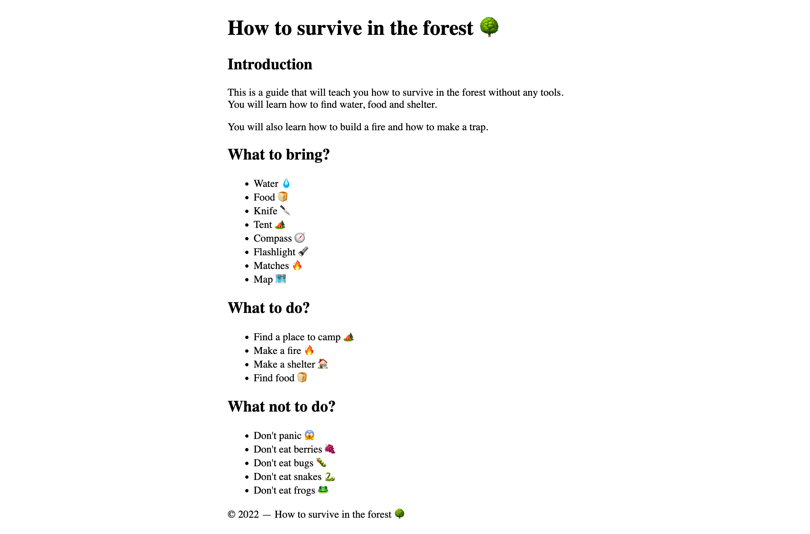

# Git Conflicts Template

This template has a few conflicts to help you practice resolving them.

> ❗️ **Important:** Follow these instructions carefully step by step.

> 💡 This repo has to be imported into your own GitHub account using the import feature to keep all the commits of this template repo. The normal GitHub Template feature flattens the history of the template repo and you will not be able to see the conflicts.

## Getting Ready

1. [command+click here to create a new repository on GitHub.com using the import repository feature](https://github.com/new/import).
2. Use this URL to import the template:

```
https://github.com/neuefische/web-git-conflicts-template
```

3. Create it as `git-conflics` in your own account. Click on "Begin import" and wait for the import to finish.
4. In your new Repository open pull requests for the `pirate`, `full-date` and `styling` branches.  
   _It's easiest to do this by command-clicking on the "Compare & pull request" buttons that appear after you have created the repository on GitHub._
5. Clone your repository to your computer.

All three branches should now show conflicts in the Pull Request interface.

## The Project

The project you're working on is a small website that explains how to survive in the forest. The `pirate` branch changes the intro text to be in pirate language. The `full-date` branch changes the copyright year to a full date in JavaScript. The `styling` branch changes the styling of the website.



> 💡 The contents of the website are not important. The conflicts are. 🤓

## Resolving Conflicts

### 1. `pirate` Branch (using `merge` on the command line)

Switch to the `pirate` branch locally and merge `main` into it.

#### Resolve the Conflict

Git now shows:

```
Auto-merging index.html
CONFLICT (content): Merge conflict in index.html
Automatic merge failed; fix conflicts and then commit the result.
```

Resolve the conflict by logically combining the changes from both branches:

- `pirate` translated the introduction to pirate speak
- `main` removed a redundant half sentence "and how to build a shelter"

Keep the translation from `pirate` and remove the redundant half sentence: "and how t' build a shelter".

#### Push the Changes

Push your new changes to the `pirate` branch and look at the Pull Request.

#### Merge using the Pull Request

Merge the `pirate` branch into `main` using the Pull Request interface and delete the `pirate` branch.

### 2. `full-date` Branch (using Resolve Conflicts on GitHub)

Go to the Pull Request for the `full-date` branch and click on the "Resolve conflicts" button above the disabled "Merge pull request" button.

#### Resolve the Conflict

Resolve the conflict by logically combining the changes from both branches:

- `full-date` changed the code to show the full date
- `main` refactored the code to only on line

Keep the changes from `full-date` as-is since the refactor to one line (on the `main` branch) was not necessary. (Accept the current change.)

Mark the conflict as resolved by clicking "Mark as resolved" and then commit it with the "Commit merge" button.

#### Merge using the Pull Request

Merge the `full-date` branch into `main` using the Pull Request interface and delete the `full-date` branch.

### 3. (Variant A) `styling` Branch (using `merge`)

> 💡 This variant is easier to do than using `rebase` (B). If you're up for a challenge, try variant B.

❗️ Go to the `main` branch locally and pull any changes from the remote before starting.

Repeat the steps of part 1 but for the `styling` branch.

To resolve the conflicts, keep the changes from the `styling` branch that introduce custom properties to the CSS but set the `--min-width` property to `68ch` (the new value from the `main` branch).

### 3. (Variant B) `styling` Branch (using `rebase` on the command line)

> 💡 This variant is more advanced and requires you to know how to use `rebase` on the command line. If you are not familiar with `rebase` yet, skip this variant and do the `merge` variant (A) instead.

❗️ Go to the `main` branch locally and pull any changes from the remote before starting.

Switch to the `styling` branch locally and rebase it to `main`.

Git now shows:

```
Auto-merging styles.css
CONFLICT (content): Merge conflict in styles.css
error: could not apply 25cca8a... move max-width to custom property
hint: Resolve all conflicts manually, mark them as resolved with
hint: "git add/rm <conflicted_files>", then run "git rebase --continue".
hint: You can instead skip this commit: run "git rebase --skip".
hint: To abort and get back to the state before "git rebase", run "git rebase --abort".
Could not apply 25cca8a... move max-width to custom property
```

#### Resolve the Conflict

Resolve the conflict in `style.css` by logically combining the changes:

- Incoming change `25cca8a` (`styling`) refactored the css file to use a custom property for `--max-width`
- Current change `HEAD` (`main`) set the max width in the `min()` function to `68ch` instead of `60ch`

Accept the incoming change from `styling` but keep the `68ch` value for `--max-width` from `main`.

> 💡 Notice that when rebasing the logic of incoming and current change is reversed.

Use `git add .` to add your changes and run `git rebase --continue` to continue the rebase.

Git opens an editor with the commit message for the rebased commit. Keep the message as-is, save and close the editor.

> 💡 Most likely you're in vim. To save and close the editor type `:wq` and press `Enter`.

#### Resolve the second conflict

Git now shows:

```
[detached HEAD 473a5e2] move max-width to custom property
 1 file changed, 13 insertions(+), 1 deletion(-)
Auto-merging styles.css
CONFLICT (content): Merge conflict in styles.css
error: could not apply dd7e7df... create more custom properties
hint: Resolve all conflicts manually, mark them as resolved with
hint: "git add/rm <conflicted_files>", then run "git rebase --continue".
hint: You can instead skip this commit: run "git rebase --skip".
hint: To abort and get back to the state before "git rebase", run "git rebase --abort".
Could not apply dd7e7df... create more custom properties
```

Resolve the conflict in `style.css` by logically combining the changes:

- Incoming change `dd7e7df` (`styling`) added more custom properties
- Current change `HEAD` (`main`) has the changes from the previously resolved conflict

Accept the incoming change from `styling` but keep the `68ch` value for `--max-width` from `main` again.

Run `git add .` and `git rebase --continue` and keep the commit message.

#### Pushing the Changes

The rebase is now finished.

If you run `git status` you should see:

```
On branch styling
Your branch and 'origin/styling' have diverged,
and have 11 and 3 different commits each, respectively.
  (use "git pull" to merge the remote branch into yours)

nothing to commit, working tree clean
```

You cannot push the `styling` branch to the remote because it has diverged from the remote. You need to force push it. Run `git push --force-with-lease` to do so.

#### Merge using the Pull Request

Merge the `styling` branch into `main` using the Pull Request interface and delete the `styling` branch.

<br>

---

> 👏 **Congratulations! You have successfully resolved all conflicts and all changes are in `main`.**
